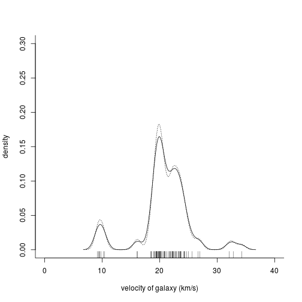

# Galaxy analysis

Some text about galaxies.


```r
require(MASS)
data(galaxies)
galaxies <- galaxies/1000
c(width.SJ(galaxies, method = "dpi"), width.SJ(galaxies))
```

```
## [1] 3.256151 2.566423
```

```r
plot(x = c(0, 40), y = c(0, 0.3), type = "n", bty = "l",
         xlab = "velocity of galaxy (km/s)", ylab = "density")
rug(galaxies)
lines(density(galaxies, width = 3.25, n = 200), lty = 1)
lines(density(galaxies, width = 2.56, n = 200), lty = 3)
```


